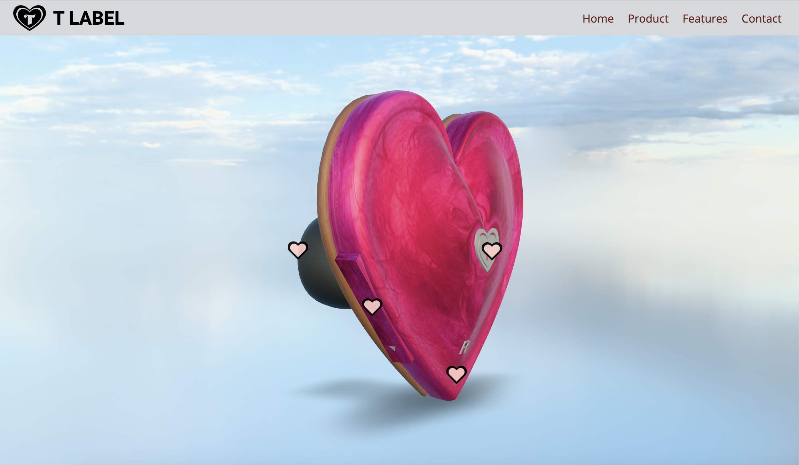

# HEART-SHAPED EARBUDS by T LABEL

This is the repo for my Earbud Product Website assignment. The project features a clean and modern website design focused on showcasing earbud products. It includes multiple sections for product details, features, and promotional content. This project includes AR integration, animated hotspots, Xray Slider/Image revealer, Vertical Scrolling Animation, Scroll-driven animations and dynamic content, with responsive design to enhance user experience on mobile, tablet, and desktop devices.

## Installation

There is no installation required.

## Usage

Open index.html in the browser of your choice.

## Contributing

1. Fork it!
2. Create your feature branch: `git checkout -b my-new-feature`
3. Commit your changes: `git commit -am 'Add some feature'`
4. Push to the branch: `git push origin my-new-feature`
5. Submit a pull request :D

## History

November 8th 2024

## Credits

Thi Thanh Thuong Nguyen (Anna)

## License

MIT - please see license file.
